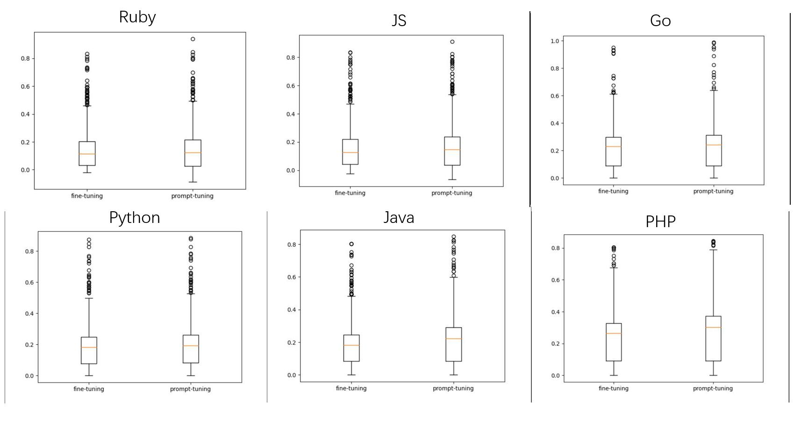

# Update 
## BoxPlot
We show aggregated results since aggregated metrics are objective and widely used to evaluate the effectiveness of the code intelligence model [1,56]. Due to the space limit, we could not give more results in the submitted paper.  Here we present the boxplots comparing prompt tuning and fine-tuning in code summarization tasks among six datasets:


We can observe that the prompt tuning has overall better performance. The median, Q1, Q3 of the boxplot of prompt tuning is consistently larger than that of fine-tuning. For instance, the averaged Q1, the first quartile, of prompt tuning achieves 24.35, which is 7.23% higher than that of fine-tuning. In addition, prompt tuning outperforms fine-tuning by 6.57% in terms of median on average.
## Converge Speed
We compare the speed of prompt tuning and fine-tuning on the Java dataset on code summarization tasks. We evaluate the speed on both full data and data scarcity scenarios:


Discussion: From the figure, we find that prompt tuning can converge faster in both full data and data scarcity scenarios. For instance, when there are 1,000 training instances, prompt tuning achieves nearly optimal results in Epoch 4, which is five epochs earlier than fine-tuning. Similarly, in full data scenario  prompt tuning achieves the  near-best performance in Epoch 2 while fine-tuning achieves that in Epoch 4.
## More Cases
Due to the space limit, we only present a case study in the code translation task. Here we give more cases.
### Code Summarization
---
```ruby
Contentful.Client.entry", "original_string": "def entry(id, query = {})
      normalize_select!(query)
      query['sys.id'] = id
      entries = Request.new(self, environment_url('/entries'), query).get
      return entries if configuration[:raw_mode]
      entries.first
    end", "language": "ruby", "code": "def entry(id, query = {})
      normalize_select!(query)
      query['sys.id'] = id
      entries = Request.new(self, environment_url('/entries'), query).get
      return entries if configuration[:raw_mode]
      entries.first
    end

```
**Ground Truth Comment**: Gets a specific entry.

**Generated by fine-tuning**: Get an entry.

**Generated by prompt tuning**: Get a specific entry by its ID.

In this case, prompt tuning generates more meaningful results that not only contain the word "specific" but also output the critical variable "ID."

---

```ruby
Turntabler.AuthorizedUser.update_laptop", "original_string": "def update_laptop(name)
      assert_valid_values(name, *%w(mac pc linux chrome iphone cake intel android))

      api('user.modify', :laptop => name)
      self.attributes = {'laptop' => name}
      true
    end", "language": "ruby", "code": "def update_laptop(name)
      assert_valid_values(name, *%w(mac pc linux chrome iphone cake intel android))

      api('user.modify', :laptop => name)
      self.attributes = {'laptop' => name}
      true
    end

```
**Ground Truth Comment**: Updates the laptop currently being used 

**Generated by fine-tuning**: Modify the laptop.

**Generated by prompt tuning**: Update the laptop.

In this case, prompt tuning successfully captures the semantics in the function of updating the laptop instead of misleading by the word "modify."

---

### Code Translation
Original C# code
```cs
public virtual FilePath GetFile()
{
  return file;
}
```
Ground truth Java code
```java
public File getFile() 
{
  return file;
}
```
Generated Java code by fine-tuning
```java
public FilePath getFile() 
{
  return file;
}
```

Generated Java code by prompt tuning
```java
public File getFile() 
{
  return file;
}
```
Discussion: prompt tuning can generate a more accurate function type "File" for the target program language instead of directly copying it from the original C# code.

# fse22_prompt
anonymous repo for fse2022

In this report, we upload all three tasks that can also be introduced in detail at CodeXGlue.
## Defect Detection
Firstly download the dataset.
```bash
cd dataset
pip install gdown
gdown https://drive.google.com/uc?id=1x6hoF7G-tSYxg8AFybggypLZgMGDNHfF
cd ..
```
We provide a prompt version and fine-tuning version.

To prompt tuning a CodeBERT, just 
```bash
cd defect/prompt
python codebert.py
```
To prompt tuning a CodeT5:
```bash
cd defect/prompt
python prompt_t5_2.py --visible_gpu <GPU> --data_dir=../dataset --max_source_length 512 --max_target_length 3 
```
To fine-tune a CodeT5, we provide the official and our implementation of CodeT5 repo in
```bash
cd defect/finetune
```

## Code Summarization
Download the dataset, where {LANG} can be one of six programming languages.
```bash
cd summarization/data
wget https://s3.amazonaws.com/code-search-net/CodeSearchNet/v2/{LANG}.zip
unzip {LANG}.zip
python preprocess.py
```
To fine-tune or prompt tuning CodeT5:
```bash
cd summarization
python finetune_t5_gene.py --visible_gpu <GPU> --lang {LANG} --max_source_length 256 --max_target_length 128 --log_name=./log/{LANG}.log
```

For prompt tuning, use prompt_t5.py.

## Code Translation
Download dataset from CodeXGlue dataset:
```bash
cd translation/data
python preprocess.py
```
The running command is similar to code summarization for fine-tune and prompt tuning.


# Full Results
## defect detection
| Template            | Verbalizer                                                                 | ACC   |
|---------------------|----------------------------------------------------------------------------|-------|
| [x] the code is [Z] | bad, defective&clean, perfect     | 63.68 |
| the code [x] is [z] | bad, defective&clean, perfect                                             | **64.17** |
| [x] it is [z]       | bad, defective&clean, perfect                                             | 63.98 |
| a [z] code [x]      | bad, defective&clean, perfect                                             | 63.36 |
| the code [x] is [z] | yes&no                                                                    | 63.08 |
| the code [x] is [z] | bad, defective&indefective, perfect                                       | **64.28** |
| the code [x] is [z] | bad&perfect                                                               | 63.71 |
| the code [x] is [z] | bad, defective, insecure&clean, perfect, secure                           | 63.26 |
| the code [x] is [z] | bad, defective, insecure, vulnerable&clean, perfect, secure,invulnerable | 63.10  |
| [SOFT] [z] [SOFT] [x]      | bad, defective&clean, perfect                                             | 62.95 |
| [x] [SOFT]*2 [z]      | bad, defective&clean, perfect                                             | 62.77 |
| [x] [SOFT]*3 [z]      | bad, defective&clean, perfect                                             | 63.15 |
| [SOFT]*10 [x] [z]      | bad, defective&clean, perfect                                             | 62.52 |
| [SOFT]*50 [x] [z]      | bad, defective&clean, perfect                                             | 62.96 |
| [SOFT]*100 [x] [z]      | bad, defective&clean, perfect                                             | 62.46 |

| CodeT5-small   | ACC   |
|----------------|-------|
| Defect [X] [Z] | 63    |
| prefix 50      | 62.34 |
| prefix 100     | 62.65 |
| prefix 150     | 63.52 |
| prefix 200     | 63.91 |
| prefix 250        | 63.77 |

| CodeT5-base    | ACC   |
|----------------|-------|
| Defect [X] [Z] | 64.98 |
| prefix 50      | 64.59 |
| prefix 100     | 64.7  |
| prefix 150     | 65.66 |
| prefix 200     | 65.82 |
| prefix 250        | 65.64 |


## Code Summarization

|                               | Ruby          | JavaScript     | Go             | Python         | Java           | PHP            | Overall        |
|-------------------------------|---------------|----------------|----------------|----------------|----------------|----------------|----------------|
| codet5-small | Fine-tuning   | 13.38          | 14.94          | 21.27          | 17.88          | 18.38          | 24.70          | 18.43          |
|        Codet5-small                       | Prompt tuning | **13.60** | **15.91** | **22.33** | **18.34** | **20.60** | **26.95** | **19.62** |
| codet5-base  | Fine-tuning   | 13.70          | 15.80          | 22.60          | 17.97          | 19.56          | 25.77          | 19.23          |
|          codet5-base                     | Prompt tuning | **14.29** | **16.04** | **23.11** | **18.52** | **19.72** | **27.06** | **19.79** |


### low resource
| Python          | 100  | 200   | 300   | 500   | 1000  | 1%    |
|-----------------|------|-------|-------|-------|-------|-------|
| CodeT5-small    | 5.42 | 7.62  | 7.89  | 11.58 | 13.23 | 14.01 |
| CodeT5-small+PT | 6.55 | 9.28  | 9.6   | 12.73 | 13.89 | 14.33 |
| CodeT5-base     | 5.8  | 8.46  | 9.36  | 13.58 | 13.86 | 14.22 |
| CodeT5-base+PT  | 7.82 | 10.78 | 12.63 | 14.77 | 14.78 | 14.81 |
|                 |      |       |       |       |       |       |
|                 |      |       |       |       |       |       |
| Ruby            | 100  | 200   | 300   | 500   | 1000  | 1%    |
| CodeT5-small    | 4.82 | 6.75  | 7.22  | 9.46  | 9.85  | 9.99  |
| CodeT5-small+PT | 6.48 | 7.89  | 8.26  | 10.89 | 10.91 | 10.85 |
| CodeT5-base     | 4.93 | 6.83  | 7.19  | 10.1  | 11.22 | 10.36 |
| CodeT5-base+PT  | 6.99 | 8.52  | 9.41  | 10.79 | 11.87 | 10.64 |
|                 |      |       |       |       |       |       |
|                 |      |       |       |       |       |       |
| PHP             | 100  | 200   | 300   | 500   | 1000  | 1%    |
| CodeT5-small    | 6.41 | 9.5   | 11.89 | 13.21 | 16.71 | 17.25 |
| CodeT5-small+PT | 7.9  | 12.23 | 14.13 | 16.26 | 17.47 | 17.88 |
| CodeT5-base     | 5.52 | 8.9   | 12.83 | 15.59 | 17.65 | 20.65 |
| CodeT5-base+PT  | 9.12 | 13.55 | 14.94 | 17.39 | 18.3  | 21.05 |
|                 |      |       |       |       |       |       |
|                 |      |       |       |       |       |       |
| go              | 100  | 200   | 300   | 500   | 1000  | 1%    |
| CodeT5-small    | 5.24 | 7.18  | 8.65  | 12.99 | 15.05 | 17.65 |
| CodeT5-small+PT | 7.2  | 11.51 | 12.42 | 14.32 | 16.88 | 17.95 |
| CodeT5-base     | 7.96 | 9.64  | 10.88 | 13.62 | 16.93 | 19.99 |
| CodeT5-base+PT  | 9.07 | 12.15 | 13.66 | 15.04 | 17.74 | 20.54 |
|                 |      |       |       |       |       |       |
|                 |      |       |       |       |       |       |
| java            | 100  | 200   | 300   | 500   | 1000  | 1%    |
| CodeT5-small    | 2.7  | 3.86  | 5.33  | 6.94  | 7.88  | 10.12 |
| CodeT5-small+PT | 3.56 | 5.89  | 7.35  | 9.9   | 10.44 | 11.18 |
| CodeT5-base     | 3.35 | 4.73  | 7.24  | 8.32  | 10.94 | 11.75 |
| CodeT5-base+PT  | 6.07 | 7.56  | 10.14 | 11.06 | 11.99 | 12.4  |
|                 |      |       |       |       |       |       |
|                 |      |       |       |       |       |       |
|                 |      |       |       |       |       |       |
| js              | 100  | 200   | 300   | 500   | 1000  | 1%    |
| CodeT5-small    | 3.56 | 5.48  | 6.97  | 7.73  | 8.36  | 9.81  |
| CodeT5-small+PT | 5.9  | 7.58  | 8.76  | 9.6   | 10.14 | 11.58 |
| CodeT5-base     | 4.14 | 5.6   | 7.07  | 10    | 10.62 | 11.53 |
| CodeT5-base+PT  | 6.5  | 8.37  | 9.61  | 11.27 | 11.81 | 12.17 |


## Code translation
|              |                | BLEU           | Accuracy       | CodeBLEU       | BLEU           | Accuracy       | CodeBLEU       |
|--------------|----------------|----------------|----------------|----------------|----------------|----------------|----------------|
|              | Naive copy     | 18.69          | 0              | -              | 18.54          | 0              | -              |
|              | Transformer    | 50.47          | 37.90          | 61.59          | 55.84          | 33.00          | 63.74          |
|              | RoBERTa (code) | 71.99          | 57.90          | 80.18          | 77.46          | 56.10          | 83.07          |
|              | CodeBERT       | 72.14          | 58.00          | 79.41          | 79.92          | 59.00          | 85.10          |
| CodeT5-small | Fine-tuning    | 78.67          | 65.40          | 82.55          | 82.29          | 63.80          | 87.01          |
| CodeT5-small | Prompt tuning  | **79.59**   | **66.00** | **83.06** | **83.33** | **64.30** | **87.99** |
| CodeT5-base  | Fine-tuning    | 79.45          | 66.10 | 83.96          | 83.61          | 65.30          | 88.32          |
| CodeT5-base  | Prompt tuning  | **79.76** | **66.10** | **84.39** | **83.99** | **65.40** | **88.74** |

